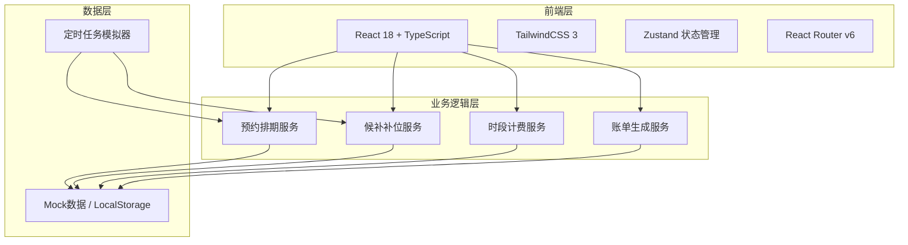
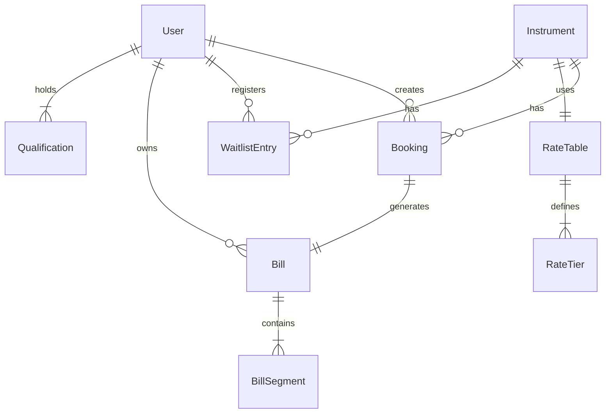

## 1. 架构设计



## 2. 技术说明

- 前端框架：React@18 + TypeScript + Vite
- 样式方案：TailwindCSS@3
- 状态管理：Zustand（轻量、适合移动端）
- 路由方案：React Router v6
- 初始化工具：Vite（react-ts模板）
- 后端：无独立后端，使用Mock数据 + LocalStorage模拟持久化
- 定时任务：前端 setInterval 模拟超时检测与候补补位

## 3. 路由定义

| 路由 | 用途 |
|------|------|
| / | 首页，仪器推荐与快捷入口 |
| /instruments | 仪器列表页，分类筛选与搜索 |
| /instruments/:id | 仪器详情页，排期日历与预约入口 |
| /booking/:id | 预约确认页，时段选择与费用预估 |
| /waitlist | 候补列表页，管理所有候补记录 |
| /waitlist/register/:id | 候补登记页，选择时段加入队列 |
| /notifications | 补位通知页，查看补位通知 |
| /billing/rates | 费率管理页，维护时段费率表 |
| /billing/bills | 账单列表页，月度汇总 |
| /billing/bills/:id | 账单详情页，费用拆分明细 |
| /admin/instruments | 仪器管理页，建档与编辑 |
| /profile | 个人中心页，资质管理 |

## 4. API定义（Mock数据接口）

### 4.1 仪器相关

```typescript
interface Instrument {
  id: string
  name: string
  model: string
  category: string
  location: string
  status: "available" | "in_use" | "maintenance"
  imageUrl: string
  description: string
  requiredQualification: string[]
  rateTableId: string
}

interface TimeSlot {
  start: string
  end: string
  status: "available" | "booked" | "waitlist"
  bookingId?: string
}
```

### 4.2 预约相关

```typescript
interface Booking {
  id: string
  instrumentId: string
  userId: string
  startTime: string
  endTime: string
  status: "pending" | "active" | "completed" | "timeout_released" | "cancelled"
  checkedIn: boolean
  createdAt: string
}

interface WaitlistEntry {
  id: string
  instrumentId: string
  userId: string
  desiredStartTime: string
  desiredEndTime: string
  position: number
  status: "waiting" | "notified" | "confirmed" | "expired" | "cancelled"
  notifiedAt?: string
}
```

### 4.3 计费相关

```typescript
interface RateTable {
  id: string
  instrumentId: string
  rates: RateTier[]
}

interface RateTier {
  dayOfWeek: number[]
  startHour: number
  endHour: number
  rateType: "peak" | "standard" | "off_peak"
  pricePerHour: number
}

interface BillSegment {
  startTime: string
  endTime: string
  rateType: "peak" | "standard" | "off_peak"
  pricePerHour: number
  durationMinutes: number
  subtotal: number
}

interface Bill {
  id: string
  bookingId: string
  userId: string
  instrumentId: string
  segments: BillSegment[]
  totalAmount: number
  status: "unpaid" | "paid"
  createdAt: string
}
```

### 4.4 用户与资质

```typescript
interface User {
  id: string
  name: string
  department: string
  avatar: string
  qualifications: Qualification[]
  role: "user" | "instrument_admin" | "system_admin"
}

interface Qualification {
  id: string
  name: string
  level: string
  instrumentCategories: string[]
  expiresAt: string
}
```

## 5. 核心业务逻辑

### 5.1 超时自动释放

- 定时器每分钟检测：预约开始后15分钟未签到的预约记录
- 释放逻辑：将预约状态置为 timeout_released，释放对应时段
- 触发补位：从候补队列中取出首位，发送补位通知

### 5.2 候补补位

- 通知发出后，候补者有10分钟确认窗口
- 确认：自动创建预约，锁定时段
- 超时/放弃：顺延通知下一位候补者
- 所有候补者均未响应：时段变为可用

### 5.3 跨档计费拆分

```
给定使用时段 [start, end] 和费率表：
1. 遍历费率表，识别所有切换点
2. 按 [start, end] 范围内的切换点拆分为多个子时段
3. 每个子时段匹配对应费率
4. 计算各子时段费用 = (时长分钟数 / 60) × 费率
5. 汇总所有子时段费用 = 总金额
```

## 6. 数据模型

### 6.1 数据模型关系图


